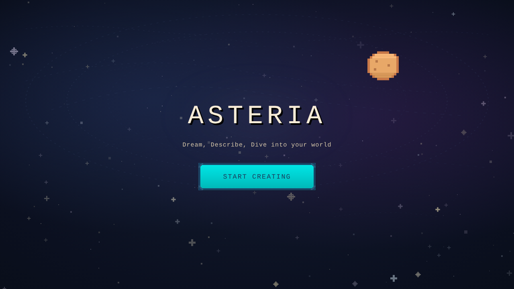

# Asteria

**Describe a world, get a playable game.** Asteria is a multi-agent AI system
that turns a natural-language prompt into a complete 2D game: it designs the
concept, writes the game code, generates the art, and packages the result as
a downloadable executable.

Built at HackTX 2025.



## How it works

1. **Describe.** In the web app you describe your world, optionally add a
   reference image, and tune sliders such as puzzle complexity and pace.
2. **Design.** A design agent turns the prompt into a structured game concept:
   genre, objective, mechanics, player abilities, enemies, and levels.
3. **Build.** A creation agent assembles the game from tested building-block
   templates (core loop, top-down or platformer movement, health and damage,
   collision, game states) and has Gemini write the game-specific logic on top.
4. **Package.** The backend bundles the game with PyInstaller and the web app
   offers it as a download.

Generation runs as a background task. The frontend polls a status endpoint and
shows progress while the agents work.

## Architecture

```
frontend/   React + TypeScript + Vite + Tailwind
  src/components/LandingPage.tsx        Landing screen
  src/components/CreativeToolPage.tsx   Prompt, sliders, generation polling
  src/components/EditPage.tsx           Result and download

backend/    Python + FastAPI
  main.py                       API server and command-line interface
  agents/game_agents.py         Design, level, asset, and creation agents,
                                coordinated by an AutonomousGameDirector
  generators/gemini_generator.py   Gemini prompts and response parsing
  engine/game_engine.py         Pygame engine: entities, collision, game states
  templates/                    Reusable gameplay building blocks
  assets/                       Sprite library and procedural asset generator

examples/   Four games Asteria generated during the hackathon
```

### API

| Endpoint                               | Description                         |
|----------------------------------------|-------------------------------------|
| `POST /api/generate/start`             | Start a generation job; returns a task ID |
| `GET /api/generate/status/{task_id}`   | Job status and result               |
| `GET /api/game/download/{filename}`    | Download the packaged game          |

## Running locally

You need Python 3.10+, Node 18+, and a
[Gemini API key](https://aistudio.google.com/app/apikey).

### Backend

```bash
cd backend
python -m venv venv
source venv/bin/activate          # Windows: venv\Scripts\activate
pip install -r requirements.txt
cp .env.example .env              # then add your GEMINI_API_KEY
python main.py --server           # http://localhost:8000
```

The backend also works from the command line:

```bash
python main.py --simple --theme "Space Adventure"
python main.py --interactive
```

### Frontend

```bash
cd frontend
npm install
npm run dev                       # http://localhost:5173
```

## Try a generated game

The games in `examples/` run on their own with only Pygame installed:

```bash
pip install pygame
python examples/turtle_trek.py
```

| Game | What it is |
|------|------------|
| `turtle_trek.py` | Guide a sea turtle hatchling across a beach to the ocean |
| `chronoclash_arena.py` | Rock-paper-scissors arena battler |
| `cosmic_grid_guardians.py` | Space-themed grid game, first to win three rounds |
| `prismatic_dash.py` | Sakura-themed dash game |

These are unedited model output, kept as they were generated.

## Team

Built by [@afafMaliha0716](https://github.com/afafMaliha0716),
[@Saurav-kan](https://github.com/Saurav-kan), and
[@juanjg05](https://github.com/juanjg05). The original hackathon repo is
[Saurav-kan/HackTXGameMaker](https://github.com/Saurav-kan/HackTXGameMaker).
